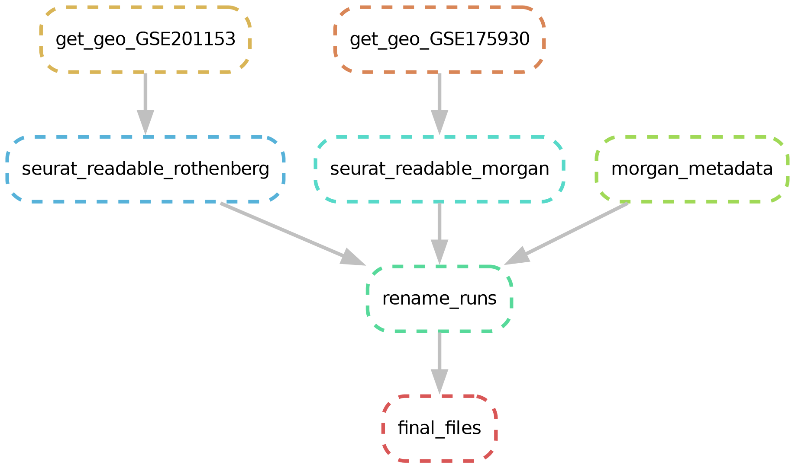

# README

This is a repository to make a reproducible project combining publicly available scRNAseq datasets 
with our/other's bulk RNAseq data about eosinophilic esophagitis

# Automated Pipeline

Snakemake automates the pipeline downloading the scRNAseq datasets **GSE201153** and **GSE175930** from the **GEO repository** 
as tar files, uncompressing them, and establishing the directory format compatible with the Seurat `Read10X` function.
For output from CellRanger >= 3.0 the directory should show barcodes.tsv.gz, features.tsv.gz, and matrix.mtx.gz. 
And the run will be named after the directory name. Additionally, it renames and selects runs of interest for
the purpose of the downstream study. 

## Pipeline Overview

The final pipeline can be seen below:

## Final Directory Structure

The final directory structure is shown here:

        data/GSE175930_organized_morgan/
        ├── P249_Esophagus
        │   ├── barcodes.tsv.gz
        │   ├── features.tsv.gz
        │   └── matrix.mtx.gz
        ├── P292_Esophagus
        │   ├── barcodes.tsv.gz
        │   ├── features.tsv.gz
        │   └── matrix.mtx.gz
        ├── P354_Esophagus
        │   ├── barcodes.tsv.gz
        │   ├── features.tsv.gz
        │   └── matrix.mtx.gz
        ├── P355_Esophagus
        │   ├── barcodes.tsv.gz
        │   ├── features.tsv.gz
        │   └── matrix.mtx.gz
        ├── P392_Esophagus
        │   ├── barcodes.tsv.gz
        │   ├── features.tsv.gz
        │   └── matrix.mtx.gz
        ├── P451_Esophagus
        │   ├── barcodes.tsv.gz
        │   ├── features.tsv.gz
        │   └── matrix.mtx.gz
        ├── P468_Esophagus
        │   ├── barcodes.tsv.gz
        │   ├── features.tsv.gz
        │   └── matrix.mtx.gz
        ├── P471_Esophagus
        │   ├── barcodes.tsv.gz
        │   ├── features.tsv.gz
        │   └── matrix.mtx.gz
        ├── P474_Esophagus
        │   ├── barcodes.tsv.gz
        │   ├── features.tsv.gz
        │   └── matrix.mtx.gz
        └── P475_Esophagus
            ├── barcodes.tsv.gz
            ├── features.tsv.gz
            └── matrix.mtx.gz
        
        10 directories, 30 files
        data/GSE201153_organized_rothenberg/
        ├── run2233
        │   ├── barcodes.tsv.gz
        │   ├── features.tsv.gz
        │   └── matrix.mtx.gz
        ├── run2242
        │   ├── barcodes.tsv.gz
        │   ├── features.tsv.gz
        │   └── matrix.mtx.gz
        ├── run2272
        │   ├── barcodes.tsv.gz
        │   ├── features.tsv.gz
        │   └── matrix.mtx.gz
        ├── run2295
        │   ├── barcodes.tsv.gz
        │   ├── features.tsv.gz
        │   └── matrix.mtx.gz
        ├── run2312
        │   ├── barcodes.tsv.gz
        │   ├── features.tsv.gz
        │   └── matrix.mtx.gz
        ├── run2326
        │   ├── barcodes.tsv.gz
        │   ├── features.tsv.gz
        │   └── matrix.mtx.gz
        ├── run2403
        │   ├── barcodes.tsv.gz
        │   ├── features.tsv.gz
        │   └── matrix.mtx.gz
        ├── run2422
        │   ├── barcodes.tsv.gz
        │   ├── features.tsv.gz
        │   └── matrix.mtx.gz
        ├── run2441
        │   ├── barcodes.tsv.gz
        │   ├── features.tsv.gz
        │   └── matrix.mtx.gz
        └── run2442
            ├── barcodes.tsv.gz
            ├── features.tsv.gz
            └── matrix.mtx.gz
        
        10 directories, 30 files
